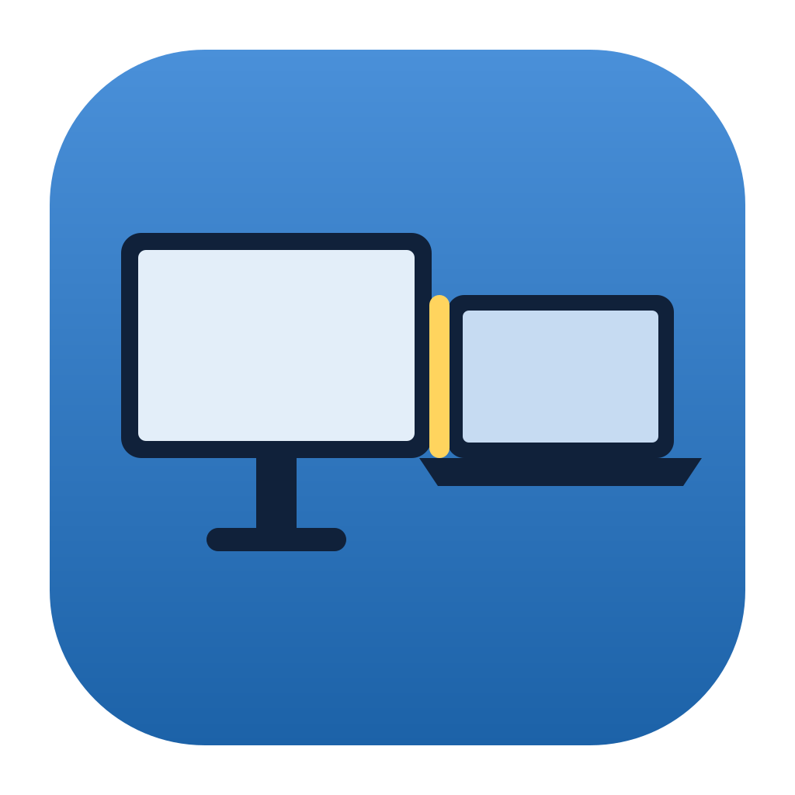
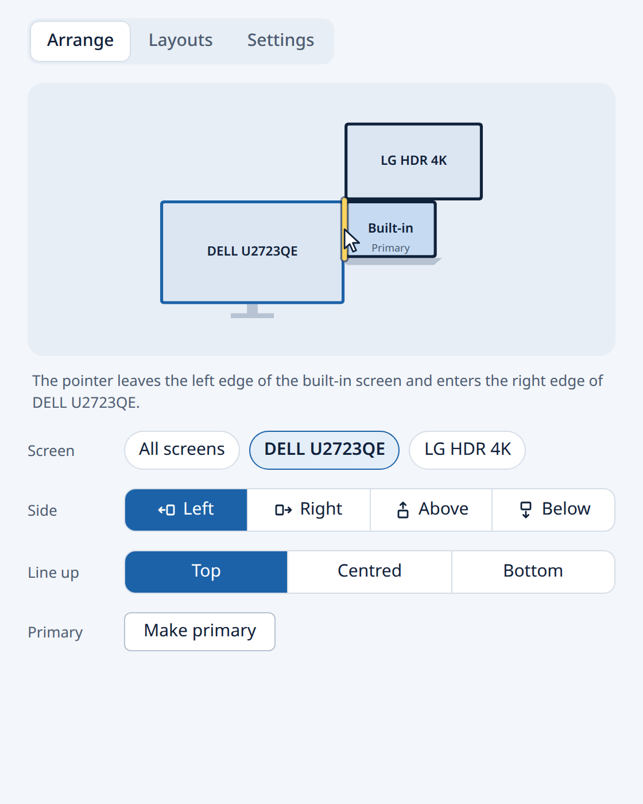

<p align="center">
  
</p>

<h1 align="center">Screen Side</h1>

<picture>
  <source media="(prefers-color-scheme: dark)" srcset="docs/img/app-dark.png">
  
</picture>

Screen Side tells your computer which side of the laptop your external monitor
stands on, so the pointer leaves through the edge that faces it. Click a side,
pick it from the tray, press a shortcut or run `screen-side left`. Save the
arrangement at each desk and it comes back by itself when you plug in there.

It runs on Windows, macOS and Linux (GNOME, KDE Plasma, Sway, Hyprland, and
X11 desktops such as Xfce), as an app with a tray icon and as a command line
tool.

Project site: <https://danieltyukov.github.io/screen-side-switcher/>

## Install

Downloads are on the [releases page](https://github.com/danieltyukov/screen-side-switcher/releases/latest).

**Windows.** Run `ScreenSide_x64-setup.exe`. It installs for your account with
no admin prompt. The installer is not code-signed, so SmartScreen asks once:
More info, then Run anyway. `ScreenSide_x64.msi` is the same build for managed
machines.

**macOS.** Open `ScreenSide_universal.dmg` (Apple silicon and Intel) and drag
Screen Side to Applications. It is not notarised, so the first time macOS
refuses to open it: go to System Settings, Privacy and Security, Open Anyway.

**Linux.** `sudo apt install ./screen-side_amd64.deb` on Debian and Ubuntu, the
`.rpm` on Fedora and openSUSE, or the `.AppImage` anywhere else (`chmod +x` it
and run it). The `.deb` and `.rpm` include the `screen-side` command. Sway,
Hyprland and other wlroots desktops also need `wlr-randr`; KDE needs
`kscreen-doctor`, which Plasma installs.

**Command line only.**

```
curl -LsSf https://danieltyukov.github.io/screen-side-switcher/install.sh | sh
powershell -ExecutionPolicy ByPass -c "irm https://danieltyukov.github.io/screen-side-switcher/install.ps1 | iex"
cargo install --git https://github.com/danieltyukov/screen-side-switcher screen-side
```

The first line is for macOS and Linux, the second for Windows. Both check the
download against the release's `SHA256SUMS`. Coming from Screen Side 1.0, the
app and `install.sh` remove the old Python install from `~/.local` the first
time they run.

## Using it

Click a screen in the drawing, then a side. With several external screens,
pick the one to move or move them all. Line up decides how the screens meet
when they are different heights: top, centred or bottom. Make primary moves
the menu bar or taskbar to the selected screen.

Under Layouts, save the arrangement for the screens connected now and mark it
Auto to have it put back whenever they connect. Under Settings, keep Screen
Side running in the background with a tray icon, start it at login, and set up
a keyboard shortcut that swaps the sides.

## Command line

```
screen-side                     show the screens and how they are arranged
screen-side left|right|above|below [--screen S] [--align start|center|end]
screen-side toggle              swap left with right and above with below
screen-side primary S           make a screen the primary one
screen-side save NAME [--auto]  remember this arrangement for these screens
screen-side apply NAME          put a saved arrangement back
screen-side layouts | forget NAME
screen-side watch               put saved layouts back as screens connect
screen-side shortcut install    set up the toggle shortcut (GNOME), or say how
screen-side doctor              what to paste into a bug report
```

`S` is a number from `screen-side status`, a connector such as `HDMI-1`, or
part of a name. `--dry-run` checks a change without making it, `--temporary`
makes it until the next reconnect, and `--json` prints machine-readable output.

## Supported desktops

| Desktop | How Screen Side talks to it | Tested on real screens |
|---|---|---|
| GNOME (Wayland and X11), Pantheon, Budgie | Mutter display configuration over D-Bus | Yes |
| KDE Plasma 5 and 6 | `kscreen-doctor` | Recorded output; reports welcome |
| Sway, Hyprland, niri, river, labwc | `wlr-randr` | Recorded output; reports welcome |
| Xfce, MATE, i3 and other X11 | `xrandr` | Recorded output; reports welcome |
| Windows 10 and 11 | Display configuration API | In CI; reports welcome |
| macOS 12 and newer | Quartz Display Services | In CI; reports welcome |

If yours is missing or misbehaves, open a
[desktop support issue](https://github.com/danieltyukov/screen-side-switcher/issues/new?template=desktop.yml)
with the output of `screen-side doctor`. [docs/BACKENDS.md](docs/BACKENDS.md)
explains how each one works and how to add another.

## Build from source

```
npm ci
npm run tauri dev                  # the app, against your real screens
cargo test --workspace && npm test
SCREEN_SIDE_BACKEND=fake cargo run -p screen-side -- status
```

The fake backend keeps two pretend screens in a JSON file, so everything can
be tried with one monitor. [CONTRIBUTING.md](CONTRIBUTING.md) has the rest,
and [docs/ARCHITECTURE.md](docs/ARCHITECTURE.md) explains how a click becomes
a layout.

## Contributing

Bug reports, ideas and pull requests are welcome. Report problems through the
[issue forms](https://github.com/danieltyukov/screen-side-switcher/issues/new/choose),
and bring ideas and questions to
[Discussions](https://github.com/danieltyukov/screen-side-switcher/discussions).
Packaging for Homebrew, winget, the AUR or Flathub would help a lot.

## Licence

MIT. See [LICENSE](LICENSE).
